# Table of Contents

1.  [Introduction](#org0951eed)
2.  [How to use](#org9bd6ac9)
    1.  [The input](#org90ffbc0)
    2.  [Example of usage](#org2029554)
3.  [Program logic](#org6ff4aea)
    1.  [The sample space](#orgd2174aa)
    2.  [Processing the input](#orgf99914f)
    3.  [Example of input processing](#orgc0c309a)

# Introduction

A calculator for finding the probability of a given event.

Specifically, the calculator requires the following input:

-   A list of all possible **simple events**.
-   One or more **known events**. Each **known event** can either be simple or compound, but must have a known probability of occurrence.
-   One **unknown event**. The **unknown event** can either be simple or compound. *This* is the event of interest: we are trying to find the probability of this event.

The output is either the probability of the unknown event, or an error message (if the provided input is found to be inconsistent, or if more information is required to solve the problem).

Try the calculator [here](https://tziyun.github.io/probability_calculator/).

# How to use

## The input

Simple events: Provide a list of all possible simple events, separated by commas and/or whitespace. The only restriction is that an event name cannot contain any commas or whitespace.

Compound events: A compound event is defined in terms of simple events, with a few additional rules. The binary operators `and` and `or` can be used to arrange simple events. All operators associate from left to right: `A or B and C` means `A or B` is evaluated first. Parentheses `()` can be used to change the order of operations: `A or (B and C) or D` evaluates differently than `A or B and (C or D)`. Parentheses can also be used for clarity: `A or B and C` evaluates the same as `(A or B) and C`.

Unknown event: Can either be simple or compound.

Known event: Can either be simple or compound. After the event, type an equals sign, followed by the probability of the event.

## Example of usage

Suppose we have the simple events `A, B, C, D`. We want to find the probability of `(A and C) or B and D`, and we know that `B and D` has probability 0.6, `A and C and D` has probability 0.2, and `A and B and C and D` has probability 0.1. After providing this information to the calculator, we find that the probability of `(A and C) or B and D` is 0.7.

# Program logic

## The sample space

Given a set of simple events, there is a finite number of ways for these events to interact in the sample space. For sets of two or three simple events, this is commonly represented with Venn diagrams:

The sample space of two simple events A and B can be split into 4 partitions:

1.  neither A or B
2.  A only
3.  B only
4.  A and B

The sample space of three simple events A, B, and C can be split into 8 partitions:

1.  none of A or B or C
2.  A only
3.  B only
4.  C only
5.  A and B only
6.  A and C only
7.  B and C only
8.  A and B and C only

Although this becomes difficult to visualize for higher-dimensional sample spaces, the underlying representation still holds. As an additional example, the following are diagrams of a sample-space of four simple events.

## Processing the input

1.  Canonicalization I
    1.  Compute all partitions of the **sample space**. Canonicalization of an event: to express the event in terms of partitions.
    2.  Canonicalize every **simple event**.
    3.  Express every **known** and **unknown** event in terms of **simple events**.
    4.  Canonicalize every **known** and **unknown** event.
2.  Canonicalization II
    1.  Compute the powerset of **sample space**. Canonicalization of an event: determine which members of the powerset are fulfilled by the event.
    2.  Canonicalize every **known** and **unknown** event.
    3.  Use process of elimination to calculate the probability of the **unknown event**.

## Example of input processing

In this section, we will demonstrate the program logic by working through [this example](#org2029554) from earlier:

> Suppose we have the simple events `A, B, C, D`. We want to find the probability of `(A and C) or B and D`, and we know that `B and D` has probability 0.6, `A and C and D` has probability 0.2, and `A and B and C and D` has probability 0.1.

(Step 1.1) Since the simple events are `A, B, C, D`, the sample space is $\{ A, B, C, D \}$. To represent all possible interactions among the simple events, we divide the sample space into 16 **partitions**, which we define as a set of regions that are mutually exclusive and jointly exhaustive. A visualization is as follows. For example: Partition 11 represents the case where only events `C` and `D` occur; Partition 13 represents the case where only events `A`, `B`, and `D` occur.

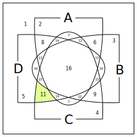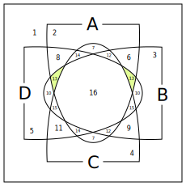

(Step 1.2) The canonicalization of each simple event is as follows (in green).

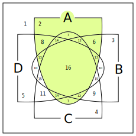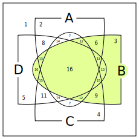

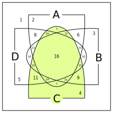

(Step 1.3 and 1.4) For example, the known event `B and D` is expressed as the shared area of events `B` and `D`. Therefore its canonicalization is as follows (in green).

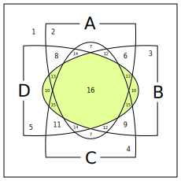

(Step 2.1) Since the sample space is $\{ A, B, C, D \}$, the powerset consists of $\{ \}$, $\{ A \}$, $\{ B \}$, $\{ C \}$, $\{ D \}$, $\{ A, B \}$, $\{ A, C \}$, $\{ A, D \}$, $\{ B, C \}$, $\{ B, D \}$, $\{ C, D \}$, $\{ A, B, C \}$, $\{ A, B, D \}$, $\{ A, C, D \}$, $\{ B, C, D \}$, and $\{ A, B, C, D \}$.

(Step 2.2) For example, the known event `B and D` fulfills the following members of the powerset: $\{ \}$, $\{ B, D \}$, $\{ A, B, D \}$, $\{ B, C, D \}$, and $\{ A, B, C, D \}$.

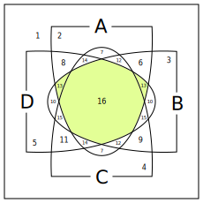

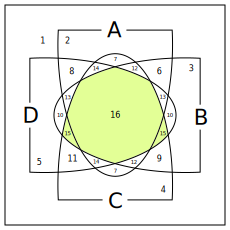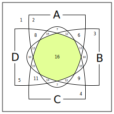

(Step 2.3) The canonicalization of each known event is mapped to its probability. This information is used to compute the probability of the unknown event. We can see that the last area (the unknown) consists of the first area, plus the second, minus the third.

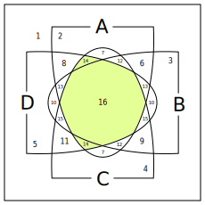

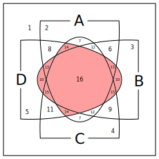

