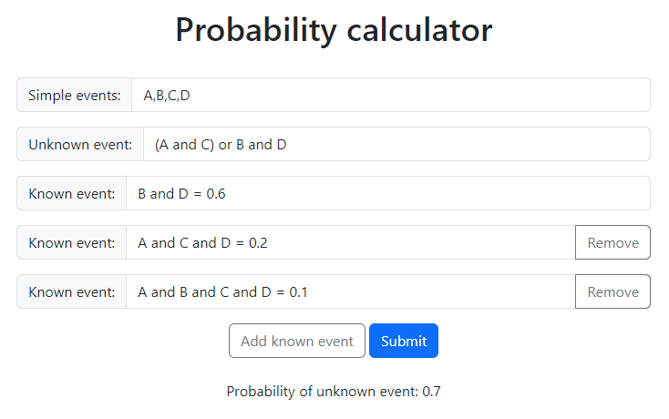
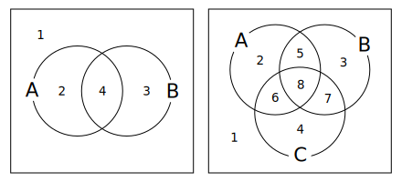
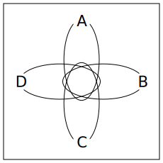
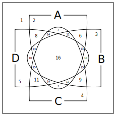

# Probability calculator

A calculator for finding the probability of a given event.

Specifically, the calculator requires the following input:
- A list of simple events
- One or more known events, compound events with known probability
- One unknown event, a compound event with unknown probability

The output is either the probability of the unknown event, or an error message if the provided input is found to be inconsistent or if more information is required to solve the problem.

Try the calculator [here](https://tziyun.github.io/probability_calculator/).

## How to use

Simple events: Provide a list of all possible simple events, separated by commas and/or whitespace. The only restriction is that an event name cannot contain any commas or whitespace.

Compound events: A compound event is defined in terms of simple events, with a few additional rules. There are two operators, `and` and `or`. The binary operators `and` and `or` can be used to arrange simple events. All operators associate from left to right: `A or B and C` means `A or B` is evaluated first. Parentheses `()` can be used to change the order of operations: `A or (B and C) or D` evaluates differently than `A or B and (C or D)`. Parentheses can also be used for clarity: `A or B and C` evaluates the same as `(A or B) and C`.

Unknown event: The unknown event is a compound event.

Known event: The known event has the same syntax as a compound event, but requires an equals sign followed by a numerical probability.

## Example

Suppose we have the simple events `A, B, C, D`. We want to find the probability of `(A and C) or B and D`, and we know that `B and D` has probability 0.6, `A and C and D` has probability 0.2, and `A and B and C and D` has probability 0.1. After providing this information to the calculator, we find that the probability of `(A and C) or B and D` is 0.7.

## Underlying representation

Given a set of simple events, there is a finite number of ways for these events to interact in the sample space. For sets of two or three simple events, this is commonly represented with Venn diagrams:

The sample space of two simple events A and B can be split into 4 partitions:
1. neither A or B
2. A only
3. B only
4. A and B

The sample space of two simple events A, B, and C can be split into 8 partitions:
1. none of A or B or C
2. A only
3. B only
4. C only
5. A and B only
6. A and C only
7. B and C only
8. A and B and C only

Essentially, each compound event is internally represented as a set of partitions. For example, given the simple events A, B, and C, a compound event of "A and B or C" is equivalent to the partitions (4), (5), (6), (7), and (8).

Although this becomes difficult to visualize for higher-dimensional sample spaces, the underlying representation still holds. As an additional example, the following are diagrams of a sample-space of four simple events, and serve as a companion to [this earlier example](https://github.com/tziyun/probability_calculator#example).

 
